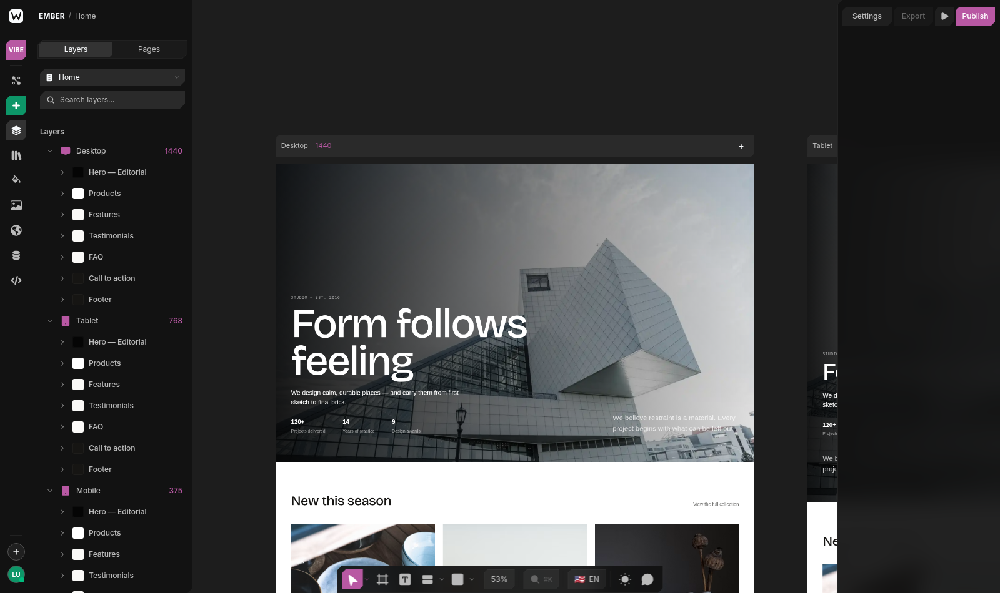
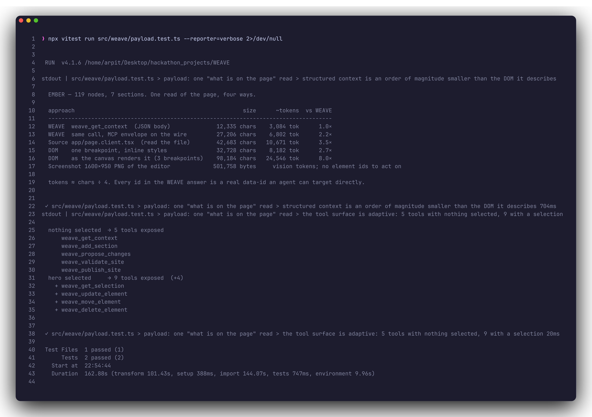
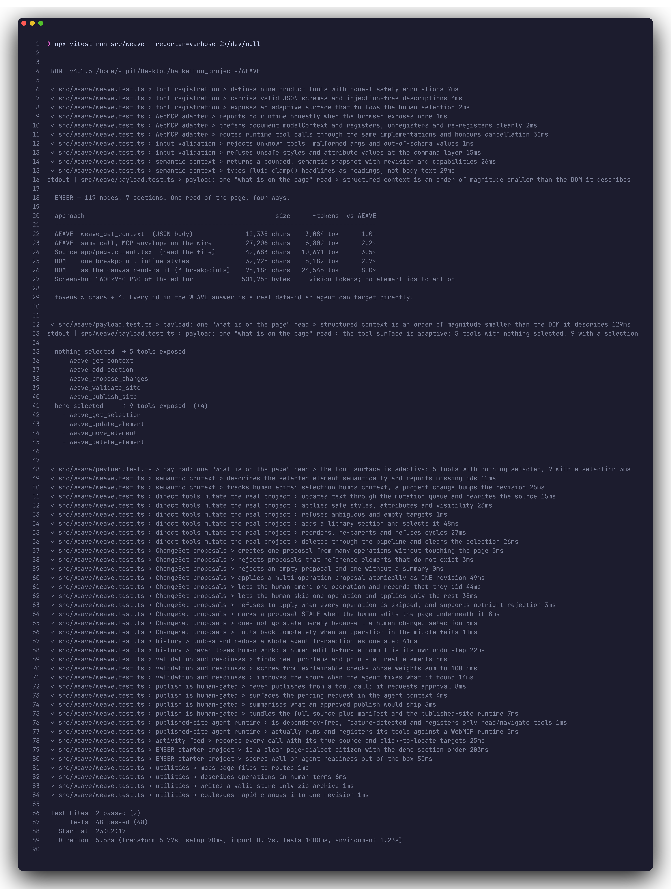
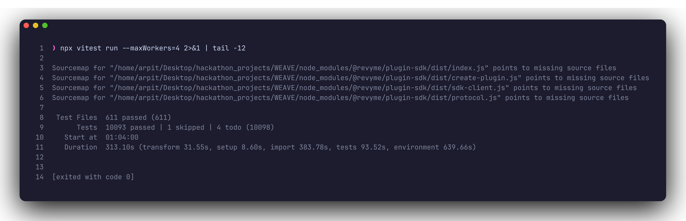
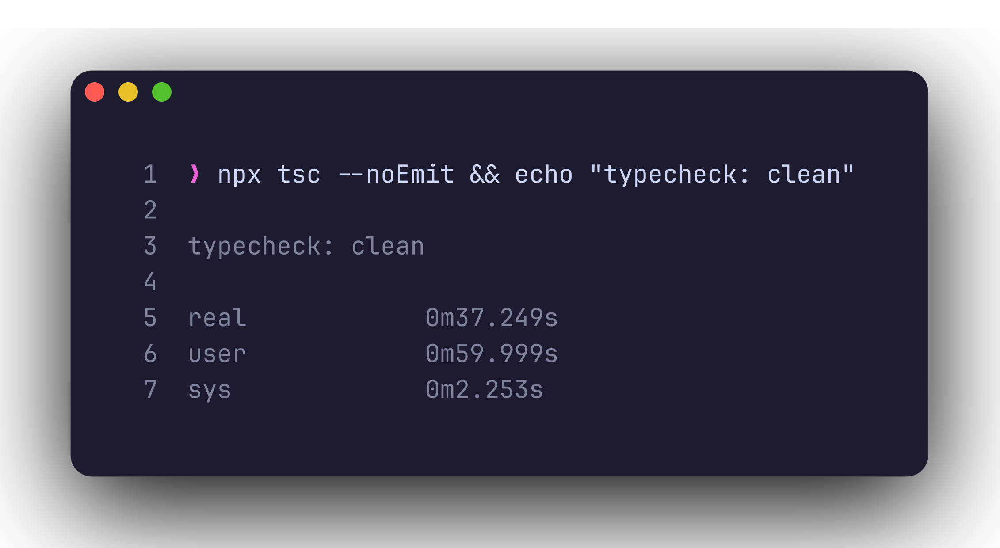
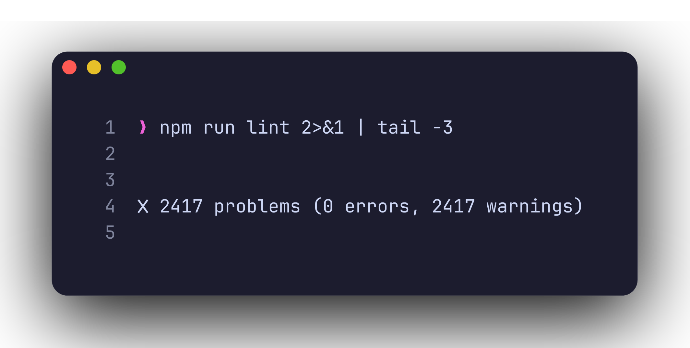
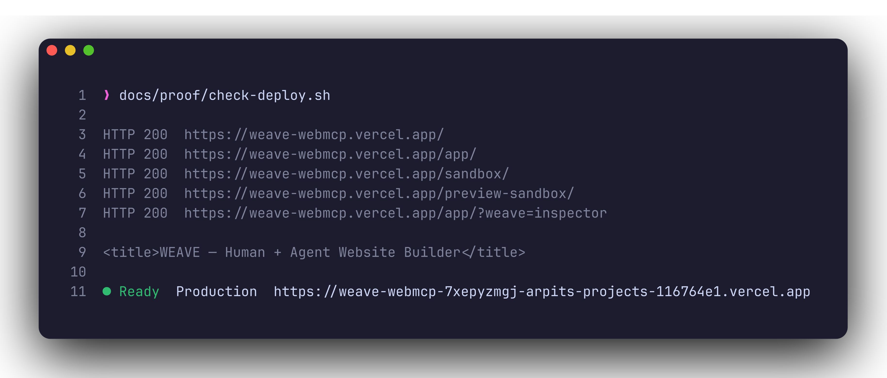

<div align="center">



# WEAVE

**The website builder built for humans and agents.**

Build visually. Direct your agent. Publish an agent-ready website.

[](https://weave-webmcp.vercel.app)
[](#7-webmcp-tools)
[](#proof)
[](#proof)
[](LICENSE)
[](https://weave-webmcp.vercel.app)

**[Landing page](https://weave-webmcp.vercel.app)** · **[Open the editor](https://weave-webmcp.vercel.app/app/)** · **[Published demo site](https://weave-webmcp.vercel.app/demo/)** · **[3-minute demo flow](FLOW.md)** · **[Demo prompts](PROMPTS.md)** · **[Proof](#proof)** · **[Simple way vs WebMCP way](#the-simple-way-vs-the-webmcp-way)** · **[Architecture](#6-architecture)**

</div>

---

WEAVE is a visual website builder in which a person and an AI agent author the **same live
project** through **WebMCP**. The human drags, types and restyles on a real canvas. The agent
reads structured project state — never the DOM — and proposes changes the human inspects,
edits and approves. Accepted work commits atomically as a new revision, and one undo reverses
it. Nothing consequential happens without a human click.

> **Works today** in the ChatGPT desktop app's built-in browser (Settings → Browser → *Enable
> site tools*, model GPT-5.6 Sol or Terra) and in Chrome 149+ with
> `chrome://flags/#enable-webmcp-testing`. With no runtime present the Agent panel says
> *No WebMCP runtime* — it never pretends.

WEAVE is built on the open-source [Revyme](docs/UPSTREAM-README.md) editor (AGPL-3.0). The
editor, canvas engine, code generation and every existing panel are upstream work, preserved
intact. WEAVE adds a layer around them — see [What WEAVE added](#15-what-weave-added).

## The three things that make it not a chatbot bolted on

| | What it is | Why it matters |
|---|---|---|
| **ChangeSets** | The agent proposes *N* edits as **one reviewable transaction**. You retype values, skip operations, apply the rest — it commits atomically as one undo step. | Most integrations demo tool calls. This demos *negotiation*. |
| **Revisions + staleness** | Every proposal is pinned to the revision it reasoned about. Edit the page first and the proposal is **refused as stale**, never applied blind. | Real concurrency control, visible in five seconds. |
| **Human gate + agent-ready output** | Publish requires your click; there is no code path from a tool call to a deploy. The bundle ships a capability manifest and runtime, so the *published site* exposes its own tools. | Closes the loop: an agent-built site is itself agent-ready. |

## Try it in three minutes

Open <https://weave-webmcp.vercel.app/app/> in a WebMCP-capable browser (the root URL is the
landing page; `/app/` is the editor), open the **WEAVE Agent** panel (first icon in the left rail — the chip reads **WebMCP connected**), and ask your agent,
in plain language:

```text
1  What's on this page right now? Tell me the sections and which one is the hero.
2  Make this homepage feel more premium. Rewrite the hero headline and the line under it,
   and add a testimonials section. Propose it as one change I can review.
3  Now propose a shorter, punchier version of that headline.   ← then edit the headline yourself → "Stale proposal"
4  Check whether this site is ready for agents to use, and tell me what's weakest.
5  Looks good — publish it.                                    ← the agent can only *request*; you approve
```

What you will see, in order: `weave_get_context` in the activity feed labelled `agent`; the
tool list growing from 25 to 39 when you click the hero; a proposal card with **nothing changed
on the canvas**; a review overlay where you amend one value and skip one operation; one
revision committed, one `Ctrl+Z` reversing all of it; a red *stale* banner with Apply
disabled; a readiness score whose checks you can click; and a publish-approval card.

The full narrated script, pre-flight checklist and recovery table are in **[FLOW.md](FLOW.md)**.
No runtime? The panel's **WebMCP Test Console** runs the identical implementations and labels
its calls `console` in the feed — never as agent calls.

## The simple way vs the WebMCP way

An agent that wants to change a website today either drives the UI from screenshots and
synthetic clicks, or scrapes the DOM and guesses. WEAVE gives it typed, described, annotated
tools over the editor's own model. The difference is measurable — and measured, by a test that
runs in CI so the numbers cannot drift from the code
([`src/weave/payload.test.ts`](src/weave/payload.test.ts)).



**One read of the EMBER page** (119 nodes, 7 sections), tokens ≈ chars ÷ 4:

| What the agent reads | Size | ~Tokens | vs WEAVE |
|---|---:|---:|---:|
| **WEAVE** — `weave_get_context`, JSON body | 12,794 chars | **3,199** | 1.0× |
| **WEAVE** — same call, full MCP envelope on the wire (body carried twice: `content` + `structuredContent`) | 28,164 chars | 7,041 | 2.2× |
| Page source, `app/page.client.tsx` — "just read the file" | 42,683 chars | 10,671 | 3.3× |
| Canvas DOM, one breakpoint, inline styles | 32,728 chars | 8,182 | 2.6× |
| Canvas DOM **as the canvas renders it** — Desktop, Tablet and Mobile side by side | 98,184 chars | 24,546 | **7.7×** |
| Live canvas iframe DOM, measured in the browser ([FLOW.md §5](FLOW.md#5-credits-and-efficiency--with-real-measured-numbers)) | 119,875 chars | ~30,000 | **9.3×** |
| Screenshot of the editor, 1600×950 PNG ([`docs/proof/editor-1600x950.png`](docs/proof/editor-1600x950.png)) | 501,758 bytes | vision tokens | no element ids to act on |

**Where the bigger saving is — round trips.** A five-part change done the usual way is five
mutations, each followed by a screenshot or DOM read to verify what happened:

```text
simple way   5 × ( mutate → re-read the DOM to verify )   ≈ 5 × 24,546  ≈ 123,000 tokens of reads
WebMCP way   get_context → ONE propose_changes (5 ops) → human applies → get_context
                                                          ≈ 2 ×  3,199  ≈   6,400 tokens of reads
```

≈ **8–9× less to read per call, and one proposal instead of five verify loops** — roughly
19× fewer read tokens for the same job. Every id in the WEAVE answer is a real `data-id` in the
source, stable across the round trip, so the agent never pays to *re-discover* the page. And
staleness prevents the most expensive failure of all: applying work against state that moved,
then paying again to detect and undo it. WEAVE refuses that up front, for free.

*This is an architectural saving backed by measured payload sizes, not a billing benchmark.*

| | Screenshot / DOM scraping | WEAVE over WebMCP |
|---|---|---|
| What the agent sees | Pixels, or a DOM with no semantics | Parsed model: section types, element ids, layout, selection |
| How it acts | Synthetic clicks and keystrokes | Typed tools, validated three times, with real safety annotations |
| Multi-step work | Fire-and-hope, one action at a time | One ChangeSet the human reviews, amends and applies atomically |
| Concurrency | Silent clobbering | Revision-pinned; a stale proposal is refused, not applied |
| Reversibility | None | One undo reverses an entire agent transaction |
| Consequences | Whatever the model decides | Publish is gated on an explicit human click |

## Proof

Every image below was produced from a clean checkout by
[`docs/proof/capture.sh`](docs/proof/capture.sh) — it runs the command shown on line 1 and
renders the real output. Regenerate any of them with `docs/proof/capture.sh "<command>" out.png`.

<details open>
<summary><b>WEAVE behaviour tests</b> — <code>npx vitest run src/weave</code> — 48 tests against the real store, parser, mutation queue and undo history</summary>
<br/>

</details>

<details>
<summary><b>Full suite</b> — <code>npx vitest run --maxWorkers=4</code> — the whole editor, upstream included (workers capped so 610 jsdom forks fit in a 14 GB laptop)</summary>
<br/>

</details>

<details>
<summary><b>Typecheck</b> — <code>npx tsc --noEmit</code> — vitest does not typecheck, so this is run separately</summary>
<br/>

</details>

<details>
<summary><b>Lint</b> — <code>npm run lint</code> — 0 errors; the 2,417 warnings are upstream <code>no-explicit-any</code> debt, left untouched on purpose</summary>
<br/>

</details>

<details>
<summary><b>Production deployment</b> — the editor and both iframe bundles served from one origin</summary>
<br/>

</details>

What the tests cover: tool registration and honest annotations, injection-free descriptions,
schema rejection, the adapter registering/unregistering/cancelling against a mock runtime,
context and selection shape, every mutation tool, ChangeSet creation, amendment, skipping,
rejection, atomic apply and mid-transaction rollback, staleness, undo/redo of an agent
transaction as one step, validation and score arithmetic, the publish gate, the activity feed,
the generated site runtime actually executing and registering its tools, and the payload
measurements above. `src/weave/e2e/weave-collaboration.spec.ts` runs the same story in
Chromium against a real editor (9 Playwright specs).

---

## 1. What WEAVE is

A code-first visual builder whose document is real Next.js source, plus:

- a **unified action pipeline** — human panels, WebMCP tools and the developer console all
  drive one command layer, so an agent edit and a human edit are literally the same mutation,
  the same generated code and the same undo entry;
- **ChangeSets** — an agent proposes several related edits as ONE reviewable transaction,
  which the human amends, partially skips, applies or rejects;
- **revisions and staleness** — every proposal is pinned to the revision it was reasoning
  about and is refused if the human has since moved the project;
- **structured semantic context** — sections with types, elements with stable ids, bounded
  (260 nodes) for an agent's budget;
- **deterministic validation** and an **explainable agent-readiness score**;
- a **human publish gate** an agent cannot bypass;
- an **agent-ready published site** — the bundle carries a capability manifest and a small
  runtime that registers the site's own tools.

## 2. Why WebMCP matters

An agent that wants to change a website today either edits raw files blind or drives the UI
by screenshots and synthetic clicks. Both are brittle, slow and unauditable. WebMCP lets a
page expose typed, described, annotated tools to an agent running in the browser. WEAVE uses
that to make the *editor itself* agent-operable: the tools speak the editor's own vocabulary,
every input is validated three times before it reaches the project, and the safety hints
reflect real consequences.

## 3. What humans can do

Everything the upstream editor does — draw, drag, resize, restyle, build components and
variants, animate, localise, manage CMS collections, edit code, preview, undo. Plus:

- watch, in the **WEAVE Agent** panel, exactly what an agent can see and has done;
- **review proposals**: read each operation's before and after, retype values, skip individual
  operations, apply or reject the rest;
- **approve or decline** any publish an agent requests;
- **check agent readiness** and jump straight to the element behind any finding;
- **inspect the WebMCP integration** — runtime, capabilities, schemas, last invocations
  (`?weave=inspector`);
- run any tool by hand from the **WebMCP Test Console**, clearly labelled as a developer
  surface, with its calls labelled `console` in the activity feed.

## 4. What agents can do

Across **48 tools**: read the project, the human's selection, one element's resolved styles
or one section in depth; **search** the page for what to act on; add library sections;
update content, safe styles and attributes; duplicate, group, ungroup, retag, move, link and
delete elements; create, open and delete **pages**; set **design tokens**; declare **page
variables**, bind styles to them and drive them from clicks and hovers; add **motion**; add
**languages** and translate into them; add and update **content-collection** items; promote
elements into reusable **components** and place them; leave the human a **note** instead of
an edit; **undo** and **redo**; read what changed since a revision; turn a validation finding
into concrete operations; propose multi-operation changes for review; validate the site; and
*request* a publish.

Every write goes through the same `WeaveOperation` pipeline, so all of it is proposable,
atomically appliable, refused when stale, and reversible in one undo. An agent cannot write
arbitrary code, touch the DOM, execute anything, or reach the project without passing schema
validation, command-layer validation and the editor's own generators.

## 5. Security posture

Three validation layers: JSON schema → command-layer allow-lists → the editor's own code
generators. No `eval`. Every vocabulary an agent can reach is an **allow-list, not a
deny-list**:

- **styles** — a fixed set of visual and layout properties; nothing that positions content
  off-canvas, and `url(…)` values must be `http(s)`;
- **attributes** — `href`, `src`, `alt`, `title`, `target`, `rel`, `aria-label`, each with its
  own value check. `javascript:`, `data:` and `vbscript:` destinations are refused;
- **tags** — semantic containers and text only, so `weave_change_element_tag` can never
  produce a `<script>`, `<iframe>`, `<object>` or form input;
- **motion** — transform and paint properties only, so an animation cannot move content out
  of the document flow;
- **content collections** — field names must exist in the collection's own schema.

Destructive and irreversible tools declare `destructiveHint` or `requiresHumanApproval` and
are enforced as such in code. Tool descriptions are purely descriptive — a test asserts they
contain no instruction-shaped text, because a tool description is an injection surface. The
WEAVE layer reads and stores no secrets.

## 6. Architecture

```
   Human (canvas, panels)                 External agent (WebMCP)
            │                                       │
            │                        document.modelContext.registerTool(weave_*)
            │                                       │
            │                    src/weave/webmcp/adapter.ts   (feature-detected)
            │                    src/weave/webmcp/registry.ts  (schema · cancel · adaptive)
            │                    src/weave/tools.ts            (the 9 core tools)
            │                    src/weave/tools-advanced.ts   (39 more, adaptively exposed)
            │                                       │
            │                          ┌────────────┴────────────┐
            │                          │                         │
            │                   direct operation        weave_propose_changes
            │                          │                         │
            │                          │                 src/weave/changeset.ts
            │                          │              propose → amend/skip → apply
            │                          │                         │
            ▼                          ▼                         ▼
        ══════════════ src/weave/commands.ts — ONE action pipeline ══════════════
                                       │ validate · allow-lists · atomic + rollback
                                       ▼
                    code/mutation/mutation-queue.ts  ──►  generators  ──►  ProjectFS
                                       │                                      │
                             history (one undo step)                    parser.ts
                                       │                                      │
                                       │                          Map<id, CanvasNode>
                                       │                              │           │
                                       │              src/weave/context.ts   canvas iframe
                                       │            (semantic snapshot + revision)
                                       ▼
                              src/weave/revision.ts  ── pins every ChangeSet
```

*Editor state → canonical model → WEAVE adapter → WebMCP tools → structured mutation →
existing update pipeline → canvas.* The canonical model is the parsed `CanvasNode` map; the
adapter is `src/weave/`; mutations are the upstream queue. File-by-file notes are in
[`src/weave/README.md`](src/weave/README.md).

## 7. WebMCP tools

| Tool | Hints | Exposed | What it does |
|---|---|---|---|
| Tool | Hints | Exposed | What it does |
|---|---|---|---|
| **Reading the project** ||||
| `weave_get_context` | read-only | always | Project, page, revision, viewports, selection, typed sections, bounded element tree, pending proposals, capabilities |
| `weave_get_selection` | read-only | selection | Full detail for the selected element: type, parent, children, layout, styles, attributes |
| `weave_find_elements` | read-only | always | Search by text, layer name, tag, semantic role or section — how an agent locates a target the human has not selected |
| `weave_get_subtree` | read-only | selection | One section or container in detail, to a requested depth, without re-reading the whole page |
| `weave_get_element_styles` | read-only | selection | Resolved (as-rendered) styles, not just declared ones — inherited values included |
| `weave_get_page_behaviour` | read-only | always | The page's variables and which elements respond to clicks and hovers |
| `weave_get_history` | read-only | always | Recent activity, with the true source (`agent`, `console`, `you`) of each action |
| `weave_diff_since` | read-only | always | What changed since a revision you read earlier — the recovery path from `CHANGESET_STALE` |
| `weave_screenshot_element` | read-only | selection | Renders one element to an image, for when appearance is genuinely the question |
| **Editing content and structure** ||||
| `weave_add_section` | write | always | Inserts an oracle-validated library section (`hero`, `products`, `features`, `testimonials`, `pricing`, `faq`, `cta`, `contact`, `footer`, `header`) |
| `weave_update_element` | write · idempotent | selection | Text, layer name, visibility, allow-listed styles, allow-listed attributes |
| `weave_move_element` | write · idempotent | selection | Reorder among siblings or re-parent, cycle-checked |
| `weave_duplicate_element` | write | selection | Copies an element and its children, with fresh ids, as the next sibling |
| `weave_group_elements` | write | always | Wraps siblings in one container, preserving order and page position |
| `weave_ungroup_element` | **destructive** | selection | Lifts a container's children into its place and removes the container |
| `weave_change_element_tag` | write · idempotent | selection | Retag to a semantic element (`h1`…`h6`, `section`, `nav`, `ul`, …); tags that load or execute are refused |
| `weave_set_link` | write · idempotent | selection | Gives an element a destination, converting it to a real Next.js `Link` first if needed |
| `weave_delete_element` | **destructive** | selection | Removes an element and its children; undoable |
| **Pages** ||||
| `weave_list_pages` | read-only | always | Every route, which is open, how many sections each has |
| `weave_create_page` | write | always | Adds a real page (server wrapper + client body) and returns its route |
| `weave_open_page` | write · idempotent | multi-page | Switches which page reads and edits apply to — and which the human sees |
| `weave_delete_page` | **destructive** · **approval** | multi-page | Removes a page; the home page and the open page are refused |
| **Design system and behaviour** ||||
| `weave_set_design_token` | write · idempotent | always | Creates or updates a named value (brand colour, heading size) that elements bind to |
| `weave_list_design_tokens` | read-only | always | The project's tokens and their current values |
| `weave_set_variable` | write · idempotent | always | Creates or updates a page variable — state the page can hold |
| `weave_bind_style_variable` | write · idempotent | selection + variables | Drives one style from a variable instead of a fixed value |
| `weave_add_interaction` | write · idempotent | selection + variables | On click or hover, set a variable — real behaviour in the published site |
| `weave_animate_element` | write · idempotent | selection | Appear-on-scroll, hover or loop motion; only transform and paint properties |
| `weave_remove_animation` | **destructive** | selection | Clears one animation, leaving the element intact |
| **Languages** ||||
| `weave_list_locales` | read-only | multi-locale | The languages the site publishes in, and which is the original |
| `weave_add_locale` | write · idempotent | always | Adds a language, with the routes and message files the site needs |
| `weave_translate_element` | write · idempotent | selection + locales | Writes an element's text in another language; the original is preserved as the default message |
| `weave_read_translation` | read-only | selection + locales | What an element currently says in a given language |
| **Content collections** ||||
| `weave_list_collections` | read-only | has collections | Collections, their fields and item counts |
| `weave_upsert_collection_item` | write · **approval** | has collections | Adds or updates structured content; unknown field names are refused |
| `weave_remove_collection_item` | **destructive** · **approval** | has collections | Deletes one item from a collection |
| **Components** ||||
| `weave_create_component` | write · **approval** | selection | Promotes an element into a reusable component |
| `weave_insert_component` | write | has components | Places a copy of an existing component |
| `weave_list_components` | read-only | has components | The components this project defines |
| **Review, history and publishing** ||||
| `weave_add_comment` | write | always | Leaves a note for the human instead of editing — the page is untouched |
| `weave_list_comments` | read-only | always | Notes on this page, including ones the human left for the agent |
| `weave_explain_finding` | read-only | always | Turns a validation finding into concrete operations ready for `weave_propose_changes` |
| `weave_undo` | write | something to undo | Reverses the last change as one step, including a whole applied ChangeSet |
| `weave_redo` | write | something to redo | Re-applies the most recently undone change |
| `weave_propose_changes` | write · **approval** | always | Submits several operations as ONE reviewable ChangeSet; changes nothing until applied |
| `weave_validate_site` | read-only | always | Real findings with element ids, plus the explainable readiness score |
| `weave_publish_site` | idempotent · **approval** | always | Requests a publish; only a human click performs one |

**48 tools, all registered on page load.** Discovery is never gated: an agent — or a scanner —
arriving at a freshly loaded editor sees the whole surface. What editor state changes is the
*order*: `applicableTools` puts what is relevant right now first, and a tool that needs a
selection says so and returns a `NO_TARGET` naming the way forward (`element_id`, or
`weave_find_elements`) rather than silently not existing.

`weave_propose_changes` publishes the full operation grammar as a JSON Schema `oneOf` —
24 branches, each with its own required fields, enums and descriptions — so an agent can
build a ChangeSet from the schema alone without parsing prose.

Hints are the MCP annotations (`readOnlyHint`, `destructiveHint`, `idempotentHint`,
`openWorldHint`) plus WEAVE's own `requiresHumanApproval` — declared *and* enforced in code.

**The surface is adaptive in ordering, not in availability.** Everything is registered on
load — hiding a capability from a headless visitor only guarantees it is never used. What
follows the project and the cursor is *relevance*: with an element selected the element
tools lead; with a second language the translation tools lead; with something to undo,
`weave_undo` leads. The Agent panel and the readiness score read that relevant set, and the
Inspector shows the whole surface with its live state.

Every result is `{ ok: true, ... }` or `{ ok: false, error: { code, message } }`, returned as
`structuredContent` alongside `content`. Codes include `UNKNOWN_TOOL`, `INVALID_ARGS`,
`CANCELLED`, `ELEMENT_NOT_FOUND`, `NO_TARGET`, `AMBIGUOUS_TARGET`, `UNSUPPORTED_STYLE`,
`UNSUPPORTED_ATTR`, `NOT_A_LINK`, `INVALID_MOVE`, `UNSUPPORTED_SECTION`, `CHANGESET_STALE`,
`CHANGESET_EMPTY`, `PUBLISH_ALREADY_PENDING`, `UNSUPPORTED_TAG`, `UNSUPPORTED_MOTION`,
`VARIABLE_NOT_FOUND`, `LOCALE_NOT_FOUND`, `PAGE_NOT_FOUND`, `PAGE_IS_OPEN`,
`CANNOT_DELETE_HOME`, `COLLECTION_NOT_FOUND`, `UNKNOWN_FIELD`, `ITEM_NOT_FOUND`,
`COMPONENT_NOT_FOUND`, `NOTHING_TO_UNDO`, `NOTHING_TO_REDO`, `CAPTURE_UNAVAILABLE`.

### How WEAVE uses the WebMCP API

| WebMCP capability | How WEAVE uses it |
|---|---|
| `document.modelContext` | Preferred host, with `navigator` / `window` fallbacks for older drafts. Chrome deprecated `navigator.modelContext` in 150; WEAVE already moved. |
| `registerTool` / `unregisterTool` | The adaptive surface — element tools registered and unregistered live as the selection changes. Duplicate-safe: re-registering a name replaces it rather than stacking. |
| `provideContext({ tools })` | Legacy replace-everything path, used only where `registerTool` is absent. |
| `getTools()` | The Inspector reads back what the *runtime* reports, not just what WEAVE thinks it sent. |
| Annotations | `readOnlyHint`, `destructiveHint`, `idempotentHint`, `openWorldHint`, plus `requiresHumanApproval`. |
| `AbortSignal` | Passed through to the dispatcher; an aborted call is refused *before* it touches project state. |
| `toolchange` events | Subscribed where the runtime emits them. |
| Feature detection | Every one of the above is detected, never assumed. No polyfill. |

`src/weave/webmcp/adapter.ts` is the only file that touches the browser surface.

## 8. Human confirmation model

**Proposals.** `weave_propose_changes` writes nothing. The Agent panel shows a proposal card;
the human opens the review, sees each operation's *now* and *will become*, retypes editable
values, skips what they dislike, and applies. Accepted operations commit atomically as ONE
undo step and one new revision. If the human edited the page since the proposal was made,
applying is refused with `CHANGESET_STALE` and their work is untouched.

**Publish.** `weave_publish_site` never publishes. It opens an approval card showing the
revision, what changed since the last publish and the readiness score. Only **Approve &
publish** flushes mutations, persists through the editor's autosave, and produces
`weave-site.zip`: your full Next.js source, `weave.manifest.json` and `public/weave-agent.js`.
No third-party deployment provider is contacted or simulated.

## 9. Local development

```bash
npm install
npm run dev        # editor :3333, canvas sandbox :5174, preview :5175
```

Two routes, identical in development and production:

| Route | What it serves | WebMCP tools |
|---|---|---|
| `/` | The landing page — static HTML, no framework | **3** — `weave_about`, `weave_list_editor_tools`, `weave_open_editor`, `weave_open_demo_site` |
| `/app/` | The editor itself | **48** — the full authoring surface |
| `/demo/` | A site *published by* WEAVE, carrying its own manifest and runtime | **3** — `weave_site_get_context`, `weave_site_read_section`, `weave_site_navigate` |

All three register on page load. The last one is the point of the whole project: an
agent-built site is itself agent-ready, and `/demo/` is somewhere you can verify that
rather than take it on trust.

Open <http://localhost:3333>, then **Open the editor**. A fresh standalone session boots on
**EMBER**, a hand-built ceramics storefront (hero, products, features, testimonials, FAQ, call
to action, footer) across three breakpoints, focused on the hero at a readable zoom. The first
icon in the left rail is **WEAVE Agent**. Node ≥ 22.

Open the Inspector directly with <http://localhost:3333/app/?weave=inspector>.

## 10. Production / Vercel deployment

The editor is three Vite bundles. Upstream serves them on three ports; WEAVE adds a
single-origin layout so a static host can serve all of them:

```bash
npm run build:vercel   # → dist/ (editor), dist/sandbox/, dist/preview-sandbox/
vercel --prod
```

The build has two HTML entries — `index.html` (landing) and `app/index.html` (editor) —
producing `dist/index.html` and `dist/app/index.html`. `vercel.json` runs the build, serves
`dist/`, rewrites `/app/*` to the editor shell, and keeps `noindex` scoped to the app and
iframe paths so the landing page stays indexable. Iframe URLs come from `VITE_SANDBOX_URL=/sandbox` and `VITE_PREVIEW_URL=/preview-sandbox` (set by the
script), so nothing depends on localhost ports.

WebMCP is a powerful capability and browsers gate it on a secure context, so a deployed HTTPS
origin is where an external agent can actually connect; the Inspector reports the
secure-context state it observes. Trade-off: on one origin the canvas iframe loses the
separate-process isolation the port-based layout provides — a performance nicety, not a
functional requirement.

## 11. Testing

```bash
npx tsc --noEmit                                     # typecheck (vitest does not)
npm run lint
npx vitest run                                       # full unit + integration suite
npx vitest run src/weave                             # WEAVE behaviour, tool and payload tests
npx playwright test src/weave/e2e                    # the collaboration loop in a browser
docs/proof/capture.sh "npx vitest run src/weave" docs/proof/tests-weave.png   # regenerate a proof image
```

## 12. Environment variables

None are required. See `.env.example`. WEAVE-specific: `VITE_SANDBOX_URL`, `VITE_PREVIEW_URL`
for single-origin deploys.

## 13. Upstream attribution

WEAVE is a derivative work of **Revyme** — open-source visual web builder, Copyright © 2026
Nikita Kofman, AGPL-3.0. The original README is preserved at
[`docs/UPSTREAM-README.md`](docs/UPSTREAM-README.md); the original `LICENSE` and `NOTICE` are
preserved (NOTICE has a WEAVE section appended, nothing removed). All upstream copyright
notices and author attributions in source files are retained.

## 14. License

AGPL-3.0-only, including Revyme's section 7(b) additional term (see `NOTICE`). WEAVE's
additions are released under the same license.

## 15. What WEAVE added

| Area | Where |
|---|---|
| Unified action pipeline (24 operations), ChangeSets, revisions, validation, publish gate, manifest, adapter, registry | `src/weave/**` (see [`src/weave/README.md`](src/weave/README.md)) |
| The 48 WebMCP tools | `src/weave/tools.ts` (core 9), `src/weave/tools-advanced.ts` (39) |
| Agent panel, proposal review overlay, WebMCP Inspector | `src/weave/ui/**` |
| Behaviour tests, payload measurements, Playwright collaboration spec | `src/weave/weave.test.ts`, `src/weave/payload.test.ts`, `src/weave/e2e/` |
| Editor wiring (`'agent'` panel, rail button, init, overlay mounts) | `src/App.tsx`, `src/code/stores/left-panel-store.ts`, `src/editor/left-toolbar/*` |
| Eight section blueprints, accessibility fixes, Sections insert category | `src/shared/sections-library/**`, `src/shared/insert-items/element-data.ts` |
| EMBER starter project, first-run camera and naming | `src/weave/starter-project.ts`, `src/weave/first-run.ts`, one branch in `src/ProjectLoader.tsx` |
| Published-site agent runtime and capability manifest | `src/weave/manifest.ts` |
| Single-origin deployment | `vercel.json`, `build:vercel`, `base` support in the two iframe Vite configs |
| Landing-page and published-site WebMCP surfaces | `index.html`, `scripts/build-demo-site.mjs` |
| Proof images and the script that regenerates them | `docs/proof/` |
| Landing page and route split (`/` landing, `/app/` editor) | `index.html`, `app/index.html`, two-entry build in `vite.config.ts`, `vercel.json` |
| Branding | `app/index.html`, `src/editor/header/LeftHeader.tsx`, `package.json` |
| Test harness shim for Node ≥ 22 `localStorage`; upstream lint-debt cleanup | `src/test-setup.ts`, `vitest.config.ts`, 34 upstream files (mechanical) |

**Deliberately not built**, to keep the core solid: Shopify connectors, multiple deployment
providers, and push-style `provideContext` of page content (the shipping API has no reliable
channel for it, so context is pull-based and the code says so).
